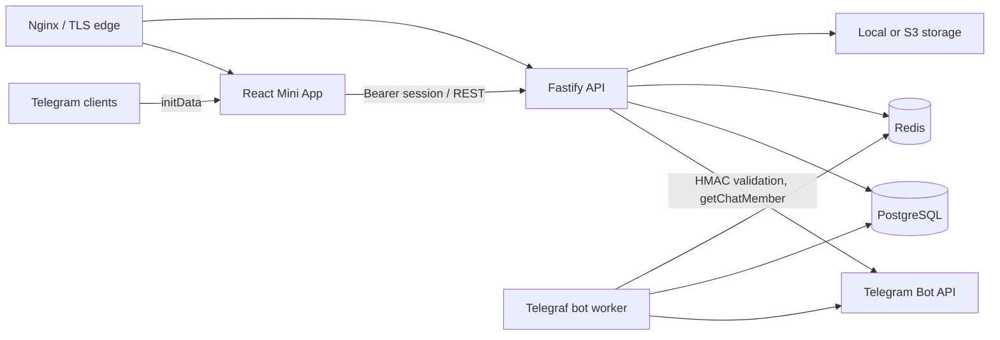

# Architecture

## Components

The deployment has separately scalable `frontend`, `backend`, and `bot` processes. They share a typed application package, PostgreSQL and Redis. Nginx is the only public container in production. The schema includes `Community` from day one, although the initial deployment seeds one community.

## Authentication flow

1. The frontend POSTs raw `initData`; it is never accepted in a URL.
2. Backend derives the WebApp secret, performs a timing-safe HMAC comparison, validates `auth_date` and required user fields, and records the query ID/hash in Redis until expiry to limit replay.
3. Backend calls `getChatMember` on first login and caches the permitted membership for a configurable interval.
4. User and membership are upserted transactionally. A short-lived signed access token containing only local IDs is returned.
5. Sensitive operations refresh membership and always enforce user status, ownership and role server-side.

## Listing lifecycle

One `ListingStatus` field is the authoritative state machine. Moderation details (`moderationComment`, moderator and time) describe transitions but do not form a second conflicting state. Every privileged transition is transactional and creates an immutable `ModerationAction`. Published substantive edits return to `pending` when community `remoderatePublishedEdits` is enabled.

## Storage and jobs

`ListingImage` supports local, S3-compatible and Telegram providers. Local/S3 uploads are decoded and re-encoded by Sharp, which validates raster content, strips metadata and rejects SVG/executable input. BullMQ queues notifications, publication, expiration and digest work; business transactions do not fail when Telegram delivery fails.

## Trust boundaries

- Client input is untrusted and validated with Zod/JSON schemas.
- Telegram identity exists only after server verification.
- Bot/admin callbacks re-read the moderator role and lock the target transition.
- PostgreSQL constraints enforce ownership-related uniqueness and decimal prices.
- Redis keys are namespaced and expiry-bound; logs redact credentials and init data.
